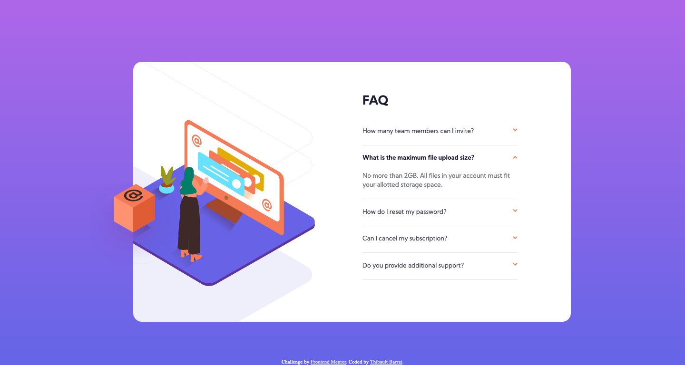

# Frontend Mentor - FAQ accordion card solution

This is a solution to the [FAQ accordion card challenge on Frontend Mentor](https://www.frontendmentor.io/challenges/faq-accordion-card-XlyjD0Oam). Frontend Mentor challenges help you improve your coding skills by building realistic projects. 

## Table of contents

- [Overview](#overview)
  - [The challenge](#the-challenge)
  - [Screenshot](#screenshot)
  - [Links](#links)
- [My process](#my-process)
  - [Built with](#built-with)
  - [What I learned](#what-i-learned)
- [Author](#author)


## Overview

### The challenge

Users should be able to:

- View the optimal layout for the component depending on their device's screen size
- See hover states for all interactive elements on the page
- Hide/Show the answer to a question when the question is clicked

### Screenshot



### Links

- Solution URL: [https://www.frontendmentor.io/solutions/animated-faq-accordion-MeidrtBJ0](https://www.frontendmentor.io/solutions/animated-faq-accordion-MeidrtBJ0)
- Live Site URL: [https://faq-accordion-card-khaki-three.vercel.app/](https://faq-accordion-card-khaki-three.vercel.app/)

## My process

### Built with

- Semantic HTML5 markup
- CSS custom properties
- Flexbox
- SASS preprocessor
- BEM methodology
- Mobile first approach


### What I learned

The main difficulty in this challenge was to correctly position the diffrent svg images using the CSS `background-image` property, for example :

```css
  background-image: url(../images/illustration-woman-online-desktop.svg);
  width: 100%;
  height: 360px;
  left: 0;
  bottom: 75px;
  transform: translateX(-17%);
  background-position-y: bottom
```

The JavaScript code to hide or show the answers is quite simple :

```js
//Show and hide answer on click on a question
var questions = document.querySelectorAll('.faq-accordion-card__question');
questions.forEach((item) => {
    item.addEventListener('click', (event) => {
        var itemCible = event.target.parentNode;
        //Delete any other existing active class to not have two open questions
        document.querySelectorAll('.faq-accordion-card__item--active').forEach((item) => {
            if (item != itemCible) {
                item.classList.remove('faq-accordion-card__item--active');
            }
        });
        //Adding active class to the item containing the clicked question
        itemCible.classList.toggle('faq-accordion-card__item--active');
    });
});

```


## Author

- Website - [Thibault Barrat](https://www.thibault-barrat.com/)
- Frontend Mentor - [@thibault-barrat](https://www.frontendmentor.io/profile/thibault-barrat)
- Twitter - [@Thib_Bar](https://www.twitter.com/Thib_Bar)
